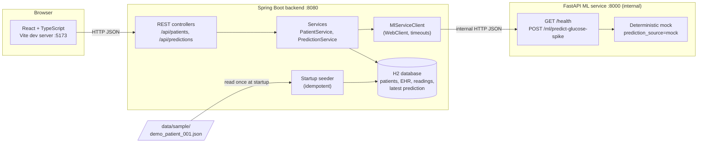
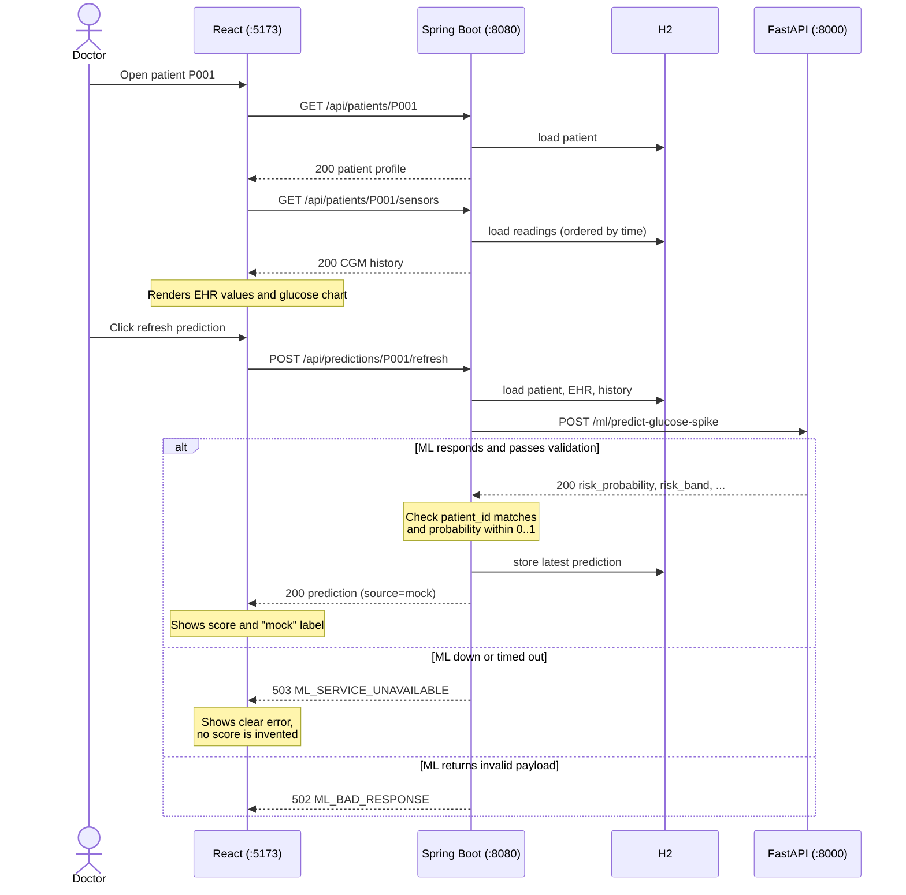

# Architecture (Phase 1 Draft)

Status: **DRAFT for review.** Owner: M2. Reviewers: M1 (ML and frontend), M3 (clinical field meanings).
Companion docs: [API_CONTRACT.md](API_CONTRACT.md), [TECH_STACK_AND_FILE_STRUCTURE.md](TECH_STACK_AND_FILE_STRUCTURE.md), [PROJECT_PHASES.md](PROJECT_PHASES.md).

## 1. Scope of This Document

This describes the system that exists at the end of **Phase 3**: a static patient snapshot with historical CGM readings and a **mock** glucose-spike prediction, flowing end to end through three services. It is not a live personalized digital twin. Streaming, real model training and scenario simulation are Phase 4 and later (section 6).

## 2. System Overview

Three services, one internal dependency chain. The browser talks only to the Spring Boot backend. The ML service is internal and is never called by the browser.



| Service | Port | Stack | Responsibility |
|---|---|---|---|
| Frontend | 5173 | React 18, TypeScript, Vite, Tailwind, Recharts, Axios | Doctor-facing dashboard. Calls only the backend. |
| Backend | 8080 | Java 21, Spring Boot 3, Spring Web, Validation, Data JPA, H2, Actuator, WebClient | Owns the public API, persistence, validation and orchestration of ML calls. |
| ML service | 8000 | Python 3.11, FastAPI, Uvicorn, Pydantic | Internal inference API. Returns a deterministic mock in Phase 3. |

## 3. Request Flow: Prediction Refresh

The core Phase 3 demo path. Mirrors `POST /api/predictions/{patientId}/refresh` in the API contract.



Design rules that follow from this flow:

- The backend never fabricates a score. A failed refresh produces an error envelope, not a number.
- A previously stored prediction keeps its original `generated_at`, so it cannot be mistaken for a fresh result.
- `prediction_source` and `model_version` are passed through unchanged so the frontend can label mock output visibly.

## 4. Data Ingestion Journey (Phase 3)

Phase 3 data is static. There is no live feed.

1. `data/sample/demo_patient_001.json` is the single canonical fixture: patient `P001`, an EHR profile and 24 hours of ordered CGM readings in `mg/dL`.
2. On backend startup, a seeder (a `CommandLineRunner`) reads the fixture and writes it to H2.
3. The seeder is **idempotent**. Restarting the backend must not duplicate the patient or readings. The fixed patient ID is the dedupe key.
4. H2 runs in memory for the demo (`jdbc:h2:mem:happyhealth;DB_CLOSE_DELAY=-1`), so data resets on restart and is re-seeded from the fixture. A file-backed H2 is an option if persistence across restarts is wanted. The choice is documented in `backend/README.md`.
5. Public JSON DTOs are separate from JPA entities so API field names stay stable if the schema changes.

Conventions shared across the whole chain: UTC ISO-8601 timestamps, glucose in `mg/dL`, missing values as `null` (never `0`).

## 5. Backend Internal Layout

Package root `com.happyhealth`:

| Package | Contents |
|---|---|
| `controller/` | `PatientController`, `PredictionController`, plus a `@RestControllerAdvice` error handler |
| `dto/` | Public request/response models matching `API_CONTRACT.md` |
| `entity/` | `Patient`, `EhrProfile`, `SensorReading`, `PredictionResult` |
| `repository/` | Spring Data JPA repositories |
| `service/` | `PatientService`, `PredictionService`, fixture seeder |
| `client/` | `MlServiceClient` |
| `config/` | `WebClientConfig`, `CorsConfig` |

Error handling maps to the standard envelope: unknown patient to 404, malformed input to 400, ML timeout or outage to 503, invalid ML payload to 502. No stack traces leave the service.

## 6. Configuration and Health

| Setting | Value |
|---|---|
| Backend port | `8080` |
| ML base URL | `${ML_SERVICE_URL:http://localhost:8000}`, configured separately from browser URLs |
| ML client timeouts | connect 3s, response 5s (proposed) |
| CORS | allow `http://localhost:5173` for local dev, or agree a Vite proxy with M1 |
| Backend health | `GET /actuator/health` |
| ML health | `GET /health` on the ML service |

Backend health and ML connectivity are reported separately. The backend process starting is not, by itself, proof the system is ready.

Inside Docker Compose, services reach each other by service name (for example `http://ml-service:8000`). Outside Compose, they use `localhost`.

## 7. Phase Boundaries

Explicitly **out of scope for the Phase 3 integration**:

| Item | Planned phase | Notes |
|---|---|---|
| MQTT broker (Mosquitto) and backend ingestion | Phase 4 | Optional, and must not be required for Phase 2 startup. |
| Synthetic sensor publisher scripts | Phase 4 | Python Paho publishers. |
| Rolling digital twin updates | Phase 4 | Phase 3 is a static snapshot only. |
| What-if scenario simulation endpoints | Phase 7 | Walk-after-meal, reduced-carb meal, custom. |
| ML model training and feature engineering | Phase 5 | XGBoost baseline. M1 coordinates; mock inference is sufficient for Phase 3. |
| SHAP explainability | Phase 5 and 6 | Phase 3 `top_factors` are mock text. |
| Real inference with live twin features | Phase 6 | Replaces the mock behind the same contract. |

### Future MQTT Event Contract (specification only)

Recorded for alignment. Not implemented before Phase 4.

```json
{
  "event_id": "evt-0001",
  "patient_id": "P001",
  "timestamp": "2026-10-09T10:30:00Z",
  "signal": "cgm",
  "value": 156,
  "unit": "mg/dL"
}
```

Topic format: `happyhealth/patients/{patient_id}/{cgm|heart-rate|steps|sleep|meal|stress}`. `event_id` is unique per event to allow idempotent ingestion.

## 8. Key Design Decisions

| Decision | Reason |
|---|---|
| Frontend calls only the backend | One public surface, one place for validation and error handling. The ML service can change freely behind the contract. |
| ML service is a separate Python service | Keeps the Java backend free of ML dependencies and lets the real model replace the mock without touching the public API. |
| Deterministic mock behind the real contract | Lets frontend and backend integrate in Phase 3 before any model exists. Only `generated_at` varies between identical calls. |
| DTOs separate from entities | Stable API field names independent of persistence changes. |
| H2 for the prototype | No external database to run for a demo. Reset-on-restart is acceptable because the fixture re-seeds it. |

## 9. Open Questions

| # | Question | Owner |
|---|---|---|
| 1 | In-memory H2 (resets on restart) or file-backed H2 for the demo? | M2 |
| 2 | Vite proxy or direct CORS for local development? | M1 + M2 |
| 3 | Does the ML mock receive the full 24h history or a trailing window? | M1 |
| 4 | Final `risk_band` casing and boundaries (see `API_CONTRACT.md`, open decisions). | M1 + M3 |

## 10. Change Log

| Date | Change |
|---|---|
| 2026-10-09 | Initial Phase 1 draft. |